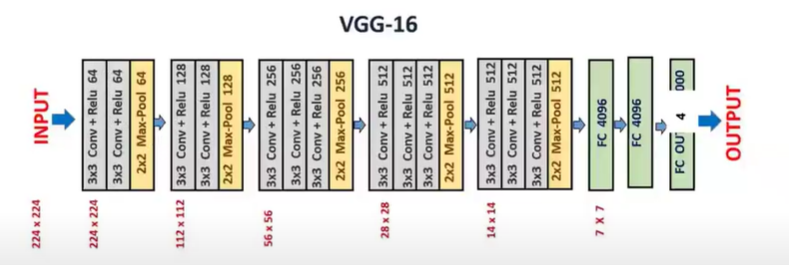

# Deep Learning Image Classification with Custom VGG16 Architecture Using Pytorch

## Overview

This project focuses on image classification using a custom-built VGG16 architecture implemented from scratch using **PyTorch**. The goal is to classify images into multiple categories effectively, leveraging deep learning techniques.

## Project Features

- **Custom VGG16 Architecture**: Designed and implemented from scratch, demonstrating a strong understanding of convolutional neural networks (CNNs).
- **Batch Normalization and Dropout**: Enhancements to improve training speed and reduce overfitting.
- **Hyperparameter Tuning**: Adjusted learning rate and added dropout layers to optimize model performance.
- **Training on CIFAR-10 Dataset**: Utilizes the CIFAR-10 dataset for training and evaluation.

## Architecture

The architecture is based on the classic VGG model, which consists of several convolutional layers followed by fully connected layers, incorporating Batch Normalization and ReLU activation functions at each layer.

## Getting Started

### Prerequisites

Make sure you have the following installed:

- Python 3.x
- PyTorch
- torchvision
- scikit-learn
- Other required libraries as listed in `requirements.txt`

## Conclusion

This project showcases the implementation of a deep learning model for image classification, highlighting the process of building a custom architecture, applying various techniques to improve performance, and thoroughly evaluating the model.
